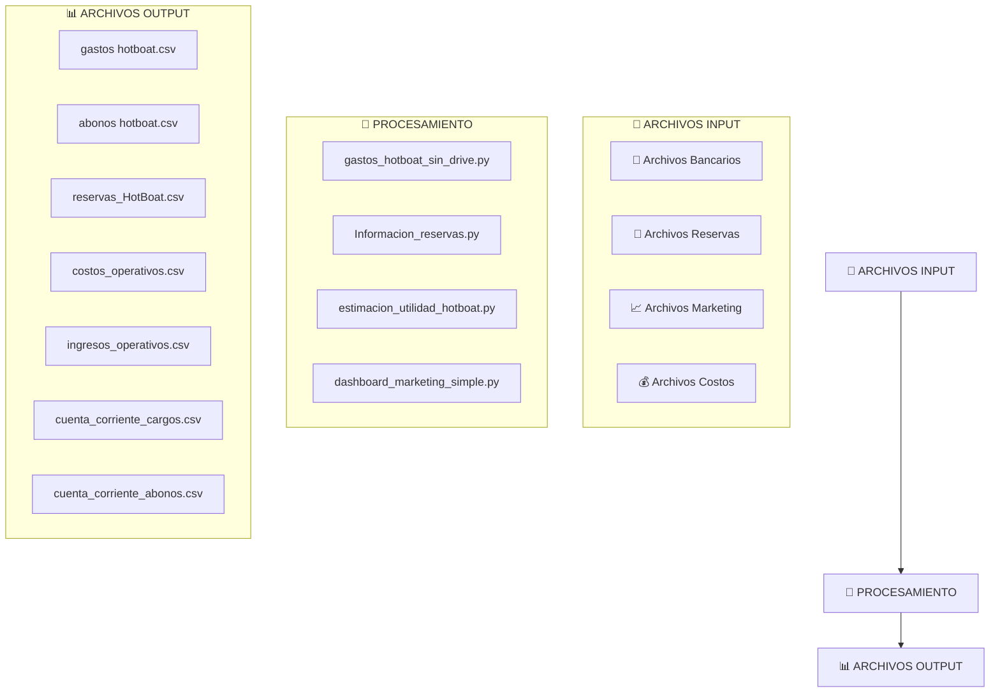
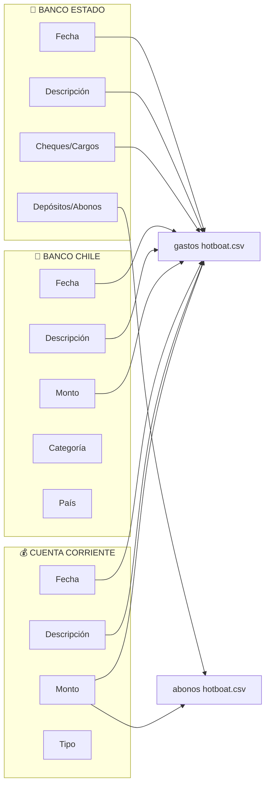
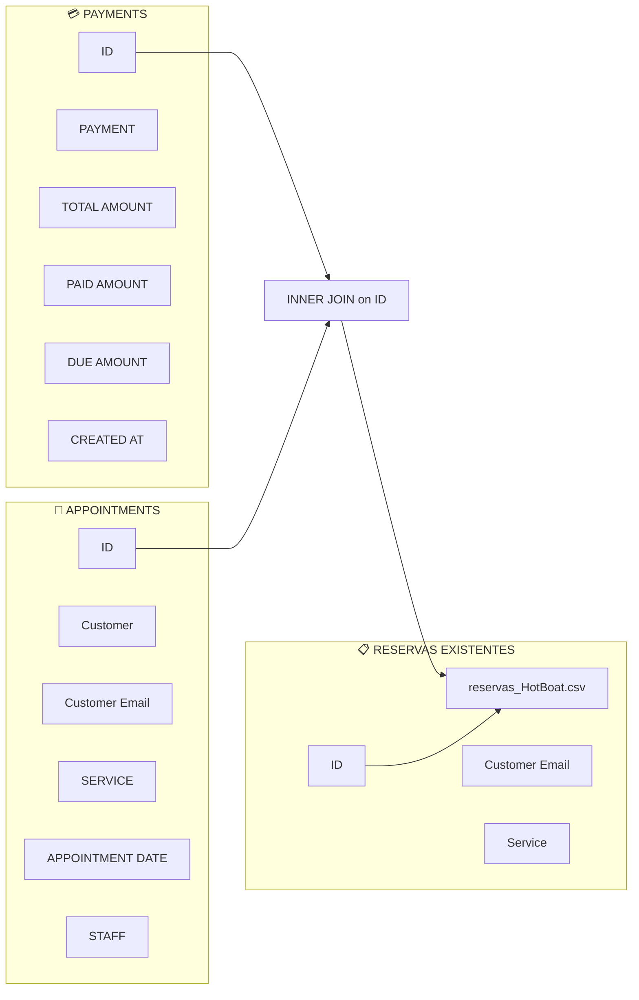
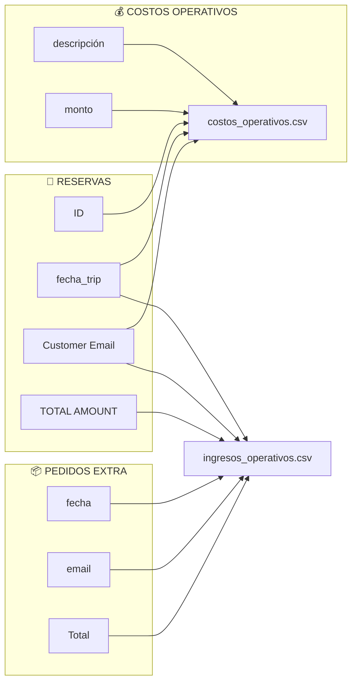
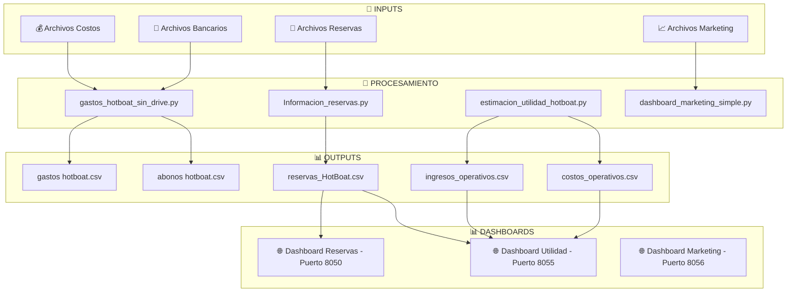

# 🔄 DIAGRAMA DE FLUJO DE DATOS - HOTBOAT

## 📊 FLUJO PRINCIPAL DE PROCESAMIENTO



---

## 🏦 PROCESAMIENTO DE GASTOS Y COSTOS

### 📁 ARCHIVOS INPUT - GASTOS
```
archivos_input/archivos_input_costos/
├── cartola*.xls                    # Cuenta corriente
├── Banco_Estado_*.xlsx            # Chequera Banco Estado
└── Banco_Chile_*.xlsx             # Movimientos Banco Chile
```

### 🔄 CRUCE DE TABLAS - GASTOS



### 📊 COLUMNAS DE SALIDA - GASTOS
| Archivo Output | Columnas Principales | Fuente de Datos |
|----------------|---------------------|-----------------|
| `gastos hotboat.csv` | Fecha, Descripción, Monto, Categoría, Categoría_1 | Banco Estado + Banco Chile + Cuenta Corriente |
| `abonos hotboat.csv` | Fecha, Descripción, Monto | Banco Estado + Cuenta Corriente |
| `cuenta_corriente_cargos.csv` | Fecha, Descripción, Monto | Cartola cuenta corriente |
| `cuenta_corriente_abonos.csv` | Fecha, Descripción, Monto | Cartola cuenta corriente |

---

## 📅 PROCESAMIENTO DE RESERVAS

### 📁 ARCHIVOS INPUT - RESERVAS
```
archivos_input/Archivos input reservas/
├── payments_*.csv                  # Pagos
├── appointments_*.csv              # Citas/Reservas
├── reservas_HotBoat.csv           # Reservas existentes
└── HotBoat - Pedidos Extras.csv   # Pedidos adicionales
```

### 🔄 CRUCE DE TABLAS - RESERVAS



### 📊 COLUMNAS DE SALIDA - RESERVAS
| Archivo Output | Columnas Principales | Fuente de Datos |
|----------------|---------------------|-----------------|
| `reservas_HotBoat.csv` | ID, fecha_trip, Customer Email, Service, TOTAL AMOUNT, DUE AMOUNT, Customer, STAFF, Phone Number_2 | Payments + Appointments + Reservas existentes |

**Nota:** Las columnas PAID AMOUNT, Phone Number y PAYMENT se eliminan durante el procesamiento. Phone Number_2 se mantiene como número procesado y formateado.

---

## 💰 PROCESAMIENTO DE UTILIDAD

### 🔄 CRUCE DE TABLAS - UTILIDAD



### 📊 COLUMNAS DE SALIDA - UTILIDAD
| Archivo Output | Columnas Principales | Fuente de Datos |
|----------------|---------------------|-----------------|
| `costos_operativos.csv` | fecha, email, id_reserva, descripción, monto | Reservas + Costo fijo por reserva |
| `ingresos_operativos.csv` | fecha, email, id_reserva, descripción, monto | Reservas + Pedidos extra |

---

## 📈 PROCESAMIENTO DE MARKETING

### 📁 ARCHIVOS INPUT - MARKETING
```
archivos_input/archivos input marketing/
├── Comp-1-Conjunto-Anuncios-2Campañas-3-anuncios-por-dia (5).csv    # CON región
├── Comp-1-Conjunto-Anuncios-2Campañas-3-anuncios-por-dia (6).csv    # SIN región
├── gasto diario en google ads.csv
└── gasto diario en meta.csv
```

### 🔄 CRUCE DE TABLAS - MARKETING

```mermaid
graph LR
    subgraph "📊 DATASET CON REGIÓN (5)"
        CR1[Día]
        CR2[Nombre del conjunto de anuncios]
        CR3[Nombre del anuncio]
        CR4[Importe gastado (CLP)]
        CR5[Impresiones]
        CR6[Clics en el enlace]
        CR7[Artículos agregados al carrito]
        CR8[Región]
    end
    
    subgraph "📊 DATASET SIN REGIÓN (6)"
        SR1[Día]
        SR2[Nombre del conjunto de anuncios]
        SR3[Nombre del anuncio]
        SR4[Importe gastado (CLP)]
        SR5[Impresiones]
        SR6[Clics en el enlace]
        SR7[Artículos agregados al carrito]
    end
    
    CR1 --> D1[Dashboard Marketing]
    CR2 --> D1
    CR3 --> D1
    CR4 --> D1
    CR5 --> D1
    CR6 --> D1
    CR7 --> D1
    CR8 --> D1
    
    SR1 --> D1
    SR2 --> D1
    SR3 --> D1
    SR4 --> D1
    SR5 --> D1
    SR6 --> D1
    SR7 --> D1
```

### 📊 COLUMNAS CALCULADAS - MARKETING
| Métrica | Fórmula | Fuente |
|---------|---------|--------|
| CTR | (Clics / Impresiones) × 100 | Dataset (5) y (6) |
| CPC | Importe gastado / Clics | Dataset (5) y (6) |
| Hook Rate 3s | (Reproducciones 3s / Impresiones) × 100 | Dataset (5) y (6) |
| Conversion Rate | (Artículos carrito / Clics) × 100 | Dataset (5) y (6) |
| Cost Per Conversion | Importe gastado / Artículos carrito | Dataset (5) y (6) |

---

## 🔗 FLUJO COMPLETO DE INTEGRACIÓN



---

## 🎯 CLAVES DE CRUCE PRINCIPALES

| Proceso | Clave de Cruce | Tablas Involucradas |
|---------|----------------|-------------------|
| **Reservas** | `ID` | payments.csv ↔ appointments.csv |
| **Utilidad** | `ID` (reserva) | reservas_HotBoat.csv ↔ costos_operativos.csv |
| **Utilidad** | `email` | reservas_HotBoat.csv ↔ pedidos_extra.csv |
| **Gastos** | `Fecha + Descripción + Monto` | Múltiples archivos bancarios |
| **Marketing** | `Día + Nombre del conjunto de anuncios` | Dataset (5) ↔ Dataset (6) |

---

## 📋 RESUMEN DE ARCHIVOS OUTPUT

| Archivo | Propósito | Columnas Clave |
|---------|-----------|----------------|
| `gastos hotboat.csv` | Gastos consolidados | Fecha, Descripción, Monto, Categoría |
| `abonos hotboat.csv` | Ingresos bancarios | Fecha, Descripción, Monto |
| `reservas_HotBoat.csv` | Reservas procesadas | ID, fecha_trip, Customer Email, Service, TOTAL AMOUNT, DUE AMOUNT, Phone Number_2 |
| `costos_operativos.csv` | Costos por reserva | fecha, email, id_reserva, monto |
| `ingresos_operativos.csv` | Ingresos operativos | fecha, email, id_reserva, monto |
| `cuenta_corriente_*.csv` | Referencia cuenta corriente | Fecha, Descripción, Monto |

---

## 🚀 EJECUCIÓN DEL FLUJO

```bash
# 1. Procesar gastos y costos
python gastos_hotboat_sin_drive.py

# 2. Procesar reservas
python Informacion_reservas.py

# 3. Calcular utilidad
python estimacion_utilidad_hotboat.py

# 4. Ejecutar dashboards
python ejecutar_todos_dashboards.py
```

Este flujo garantiza que todos los datos estén sincronizados y actualizados para los dashboards de análisis. 